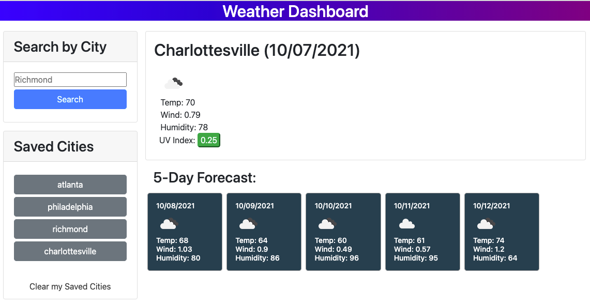

# Weather Dashboard App
Week 6 Challenge: Weather Dashboard

## Purpose

A weather dashboard app that allows user to search by city

## Functionality

* Current weather displayed in main area

* 5 day forecast displayed in area below

* Searched cities get saved to a section with clickable buttons in area below main city search 

* Searched cities get saved in localStorage 

* User can clear their saved cities with click of clear my saved cities link

## Links to Content

* [URL of the GitHub repository](https://github.com/cshepscorp/weather-dashboard)

* [URL of the deployed application](https://cshepscorp.github.io/weather-dashboard/)

## Built With

* HTML

* CSS

* Javascript

* Fetch

